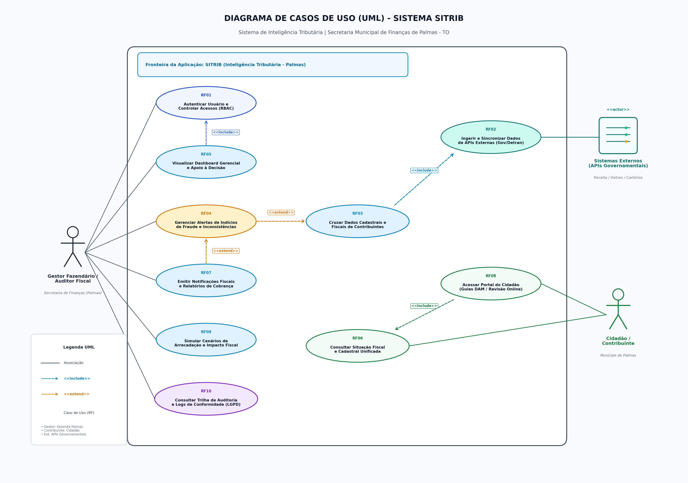

# Projeto Integrador (PI) - Sprint 1

Este repositório contém a entrega da Sprint 1, abordando o Setup Ágil, Engenharia de Requisitos, Repositório Git e estruturação inicial em MVC..

## 2.1. Identificação da Equipe e Links

| Nome do Integrante | Matrícula | E-mail | Papel Principal no Time |
|---|---|---|---|
| Hyago Queiroz | 2026111524 | hyago.queiroz@mail.uft.edu.br | Product Owner (PO) |
| Vitória Alves | 2026110968 | vitoria.alves1@mail.uft.edu.br | Scrum Master (SM) |
| Sofia Barros | 2026111954 | sofia.barros@mail.uft.edu.br | Desenvolvedor / Equipe Técnica |
| Ludmylla Teixeira | 2026111870 | ludmylla.teixeira@mail.udt.edu.br | Desenvolvedor / Equipe Técnica |
| Maiara Ktidi Xerente | 2026111868 | maiara.xerente@mail.uft.edu.br | Desenvolvedor / Equipe Técnica |

**Link do Repositório GitHub:** https://github.com/24sofiabarros/projeto_integrador_II

---

## 2.2. Fundamentação e Dinâmica dos Papéis Ágeis

### A) Product Owner (PO)
1. **Quem é o Product Owner da equipe?**
   [Nome do Integrante PO]
2. **Quais são as principais atribuições e responsabilidades do PO perante o Projeto Integrador?**
   [Preencher fundamentação]
3. **Como o PO validará se as funcionalidades entregues cumprem o propósito do projeto?**
   [Preencher validação]

### B) Scrum Master (SM)
1. **Quem é o Scrum Master da equipe?**
   [Nome do Integrante SM]
2. **Quais são as responsabilidades do Scrum Master na condução do time?**
   [Preencher responsabilidades]
3. **Qual será o canal de comunicação oficial da equipe e a frequência dos alinhamentos semanais?**
   [Preencher comunicação]

---

## 2.3. Especificação de Requisitos Funcionais (RF)

| ID | Nome do Requisito | Descrição / História de Usuário | Critérios de Aceite (Validação) |
| :--- | :--- | :--- | :--- |
| **RF01** | Autenticação e Controle de Acesso Baseado em Perfis (RBAC) | O sistema deve autenticar gestores, auditores fiscais e operadores da Secretaria Municipal de Finanças de Palmas via credenciais institucionais seguras com duplo fator (MFA) ou Gov.br, garantindo controle de acesso granular baseado em papéis (RBAC). | 1. O sistema deve bloquear tentativas de acesso não autenticadas ou com perfis não autorizados em rotas restritas, registrando tentativa inválida após 3 falhas consecutivas. 2. Usuários com perfil 'Gestor Fazendário' devem ter acesso a visões agregadas e estratégicas, enquanto 'Auditores Fiscais' devem ter acesso a dados fiscais analíticos e ferramentas de cruzamento. |
| **RF02** | Ingestão e Integração de Dados de APIs Externas Governamentais | O sistema deve consumir dados de bases externas governamentais (como Receita Federal/CNPJ, Cartórios de Registro de Imóveis e Detran-TO) de forma agendada ou sob demanda para enriquecer e sincronizar a base cadastral tributária de Palmas (IPTU, ISS, ITBI). | 1. Ao disparar a sincronização com serviço externo, o sistema deve processar os dados retornados com sucesso (código HTTP 200) e atualizar os registros cadastrais em lote validando integridade estrutural. 2. Em caso de indisponibilidade da API externa (timeout ou código HTTP 5xx), o sistema deve registrar a falha em log de erros, manter o estado íntegro dos dados prévios e disparar retentativa automática com recuo exponencial. |
| **RF03** | Cruzamento Automatizado de Dados Fiscais e Cadastrais | O sistema deve cruzar automaticamente informações fiscais declaradas por cidadãos e empresas de Palmas (notas fiscais de serviços eletrônicas - NFS-e, declarações de faturamento e cadastros imobiliários) com as bases de dados externas para identificar inconsistências cadastrais e divergências de receita. | 1. O sistema deve confrontar as declarações de faturamento de ISS com dados de emissão de NFS-e e pagamentos eletrônicos, sinalizando registros em que a diferença ultrapasse a margem de tolerância definida em configuração (ex.: 5%). 2. A rotina de cruzamento deve gerar um relatório detalhado contendo a lista de contribuintes divergentes, valores apurados e data/hora de execução da conciliação. |
| **RF04** | Detecção e Geração de Alertas de Indícios de Fraude e Inconsistências | O sistema deve gerar alertas automáticos classificados por grau de criticidade (Baixa, Média, Alta) sempre que forem detectadas incongruências patrimoniais, subavaliação de ITBI ou sinais de sonegação fiscal. | 1. Cada alerta gerado deve indicar claramente o contribuinte (CPF/CNPJ), a tipologia do indício identificado, o valor estimado de inconsistência e a severidade calculada pelo motor de regras. 2. O sistema deve disponibilizar um fluxo de gestão de alertas onde o auditor possa alterar o status para 'Pendente', 'Em Apuração', 'Procedente' ou 'Descartado', exigindo justificativa textual obrigatória para encerramento. |
| **RF05** | Painel de Bordo Gerencial e Apoio à Tomada de Decisão (Dashboard) | O sistema deve fornecer aos gestores da Secretaria de Finanças um painel visual e interativo contendo indicadores-chave de desempenho (KPIs) da arrecadação municipal (IPTU, ISS, ITBI), índices de inadimplência, projeções de receita e mapas de concentração de dívida ativa em Palmas. | 1. O painel deve permitir filtros dinâmicos por tributo, exercício financeiro, mês e zona fiscal, recalculando e renderizando os gráficos analíticos em até 3 segundos. 2. Todos os valores sumarizados apresentados no dashboard devem coincidir exatamente com a soma dos lançamentos validados na base relacional do sistema. |
| **RF06** | Consulta Cadastral e Fiscal Unificada do Contribuinte | O sistema deve disponibilizar funcionalidade de busca unificada por CPF ou CNPJ que consolide em tela única toda a ficha cadastral do contribuinte, imóveis vinculados, histórico de recolhimentos, parcelamentos e certidões ativas. | 1. Ao submeter um CPF/CNPJ válido, o sistema deve apresentar a ficha unificada completa em menos de 2 segundos, exibindo débitos vencidos e a vencer segregados por exercício. 2. Caso o identificador consultado não exista na base local, o sistema deve informar mensagem amigável e permitir ao auditor consultar a existência do cadastro nas bases externas integradas. |
| **RF07** | Emissão de Notificações Fiscais Administrativas e Cobrança | O sistema deve gerar minutas de notificação fiscal de cobrança e autos de intimação administrativa em formato PDF padronizado para contribuintes com divergências ou débitos confirmados. | 1. O documento PDF gerado deve conter o brasão oficial da Prefeitura de Palmas, número de processo fiscal, chave de autenticação digital única e QR Code para validação pública de autenticidade. 2. O sistema deve registrar o histórico de notificações emitidas na ficha do contribuinte, com registro de data de emissão, canal de envio e status de ciência/entrega. |
| **RF08** | Portal de Autoconsulta e Regularização Tributária para o Cidadão | O sistema deve disponibilizar portal de autoatendimento para o contribuinte municipal consultar seus tributos (IPTU, ISS, taxas), emitir guias de recolhimento (DAM) com PIX/código de barras e abrir solicitações de revisão cadastral. | 1. O munícipe deve conseguir gerar o Documento de Arrecadação Municipal (DAM) para pagamento à vista ou parcelado, com código de barras e chave PIX Copia e Cola válidos. 2. Ao submeter pedido de revisão cadastral ou contestação de lançamento, o sistema deve emitir protocolo de acompanhamento e anexar os comprovantes fiscais enviados para análise do auditor. |
| **RF09** | Simulação de Cenários de Arrecadação e Impacto Tributário | O sistema deve disponibilizar ferramenta de modelagem preditiva para gestores simularem o impacto financeiro de políticas fiscais públicas (concessão de descontos em IPTU, alteração de alíquotas de ISS e programas de parcelamento incentivado - REFIS). | 1. O gestor deve ser capaz de definir variáveis de simulação (percentuais de desconto, projeção de adesão) e visualizar comparativo de impacto entre a receita projetada e o exercício fiscal anterior. 2. O resultado da simulação deve poder ser exportado em formatos abertos (CSV e PDF) com resumo dos parâmetros aplicados para subsidiar peças de planejamento orçamentário (LDO/LOA). |
| **RF10** | Trilha de Auditoria e Logs de Conformidade (LGPD e Segurança Pública) | O sistema deve registrar de forma auditável e imutável todas as operações realizadas pelos usuários sobre dados pessoais e fiscais, atendendo às exigências da LGPD e normas de transparência e segurança pública. | 1. Toda visualização de dados sensíveis, alteração de status fiscal, cruzamento de dados ou exportação de relatórios deve registrar log com identificador do usuário, perfil, timestamp ISO-8601, endereço IP e ação executada. 2. O módulo de trilha de auditoria deve ser acessível apenas por administradores e fiscais com permissão de correição, proibindo estritamente a alteração ou exclusão de quaisquer registros de log. |

### 2.3.1. Diagrama de Casos de Uso (UML)

O diagrama abaixo apresenta os principais casos de uso decorrentes dos requisitos funcionais especificados acima, mapeando as interações dos atores (**Gestor Fazendário / Auditor Fiscal**, **Cidadão / Contribuinte** e **Sistemas Externos**) com as fronteiras do sistema SITRIB:

---

## 2.4. Requisitos Não Funcionais (RNF)
*(A ser preenchido pela Vitória)*

| ID | Categoria | Descrição da Restrição | Métrica / Forma de Teste |
| :--- | :--- | :--- | :--- |
| **RNF01** | Tecnologia / Backend | O sistema deve ser desenvolvido utilizando a linguagem Python e estruturado no padrão MVC. | Compatível com Python 3.12+. |
| **RNF02** | Portabilidade | As dependências devem estar isoladas no manifesto de pacotes. | Instalação com comando padrão via `requirements.txt`. |
| **RNF03** | [Categoria] | [Descrição] | [Métrica] |

---

## 2.5. Matriz de Priorização MoSCOW

*   **Must Have:** [Preencher]
*   **Should Have:** [Preencher]
*   **Could Have:** [Preencher]
*   **Won't Have:** [Preencher]

---

## 2.6. Comprovação de Contribuições no Git
*(A ser preenchido por Hyago e Maiara)*

Os prints de colaboração devem ser salvos na pasta `docs/`.

