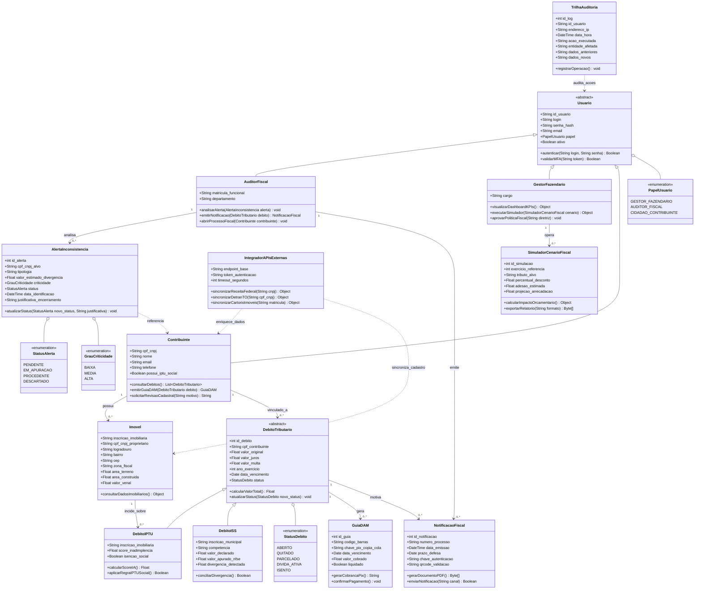

# Diagrama de Classes - Sistema SITRIB

Este documento apresenta a modelagem orientada a objetos das entidades centrais do **SITRIB (Sistema Integrado de Gestão Tributária)**, refletindo a arquitetura em camadas (MVC) e as regras de negócio especificadas nos Requisitos Funcionais (RF01 a RF10).

---

## 1. Diagrama de Classes (Mermaid)

---

## 2. Descrição das Entidades Principais

### A) Núcleo de Usuários e Acesso (RBAC - RF01)
* **`Usuario`**: Classe base/abstrata que reúne as credenciais de autenticação, e-mail institucional, controle de status e validação de duplo fator (MFA / Gov.br).
* **`AuditorFiscal`**: Subclasse com atribuições de correição e fiscalização: análise de alertas fiscais, cruzamento de declarações com notas fiscais e emissão de intimações.
* **`GestorFazendario`**: Subclasse voltada à gestão estratégica: visualização de indicadores do painel executivo (KPIs) e realização de simulações orçamentárias.
* **`Contribuinte`**: Subclasse associada a munícipes e pessoas jurídicas: permite consulta integrada de situação fiscal, solicitação de revisões cadastrais e emissão de guias DAM com PIX.

### B) Núcleo Tributário e Imobiliário (RF06 e RF08)
* **`Imovel`**: Modela a unidade física e territorial cadastrada no município de Palmas, vinculando dados como zona fiscal, área e valor venal para apuração de IPTU.
* **`DebitoTributario`**: Classe abstrata comum a todas as dívidas tributárias municipais, padronizando o cômputo de juros, multas, prazos de vencimento e ciclo de vida do débito.
* **`DebitoIPTU`**: Especialização para débitos prediais/territoriais urbanos, incorporando o `score_inadimplencia` gerado pelo módulo preditivo de IA e as diretrizes de isenção do **IPTU Social**.
* **`DebitoISS`**: Especialização para o imposto sobre serviços, agregando conciliação entre o faturamento mensal declarado e as notas fiscais emitidas (NFS-e).

### C) Fiscalização, Cobrança e Arrecadação (RF03, RF04 e RF07)
* **`AlertaInconsistencia`**: Instanciada pelo motor de cruzamento de dados quando há incongruências patrimoniais, desvios de ISS ou indícios de sonegação, com níveis de criticidade (Baixa, Média, Alta).
* **`NotificacaoFiscal`**: Documento oficial expedido ao contribuinte com número de processo administrativo, QR Code de validação pública e chave criptográfica.
* **`GuiaDAM`**: Documento de Arrecadação Municipal que consolida débitos para pagamento, suportando código de barras FEBRABAN e chave dinâmica PIX (copia e cola).

### D) Governança, Integrações e Auditoria (RF02, RF05, RF09 e RF10)
* **`IntegradorAPIsExternas`**: Camada de serviço desacoplada para comunicação síncrona/assíncrona com Receita Federal, Detran-TO e Cartórios de Imóveis.
* **`SimuladorCenarioFiscal`**: Módulo preditivo para análise de impacto fiscal diante de variações de alíquotas ou programas de regularização (REFIS).
* **`TrilhaAuditoria`**: Entidade de registro imutável para todas as operações sensíveis no sistema, garantindo conformidade rigorosa com a LGPD.
